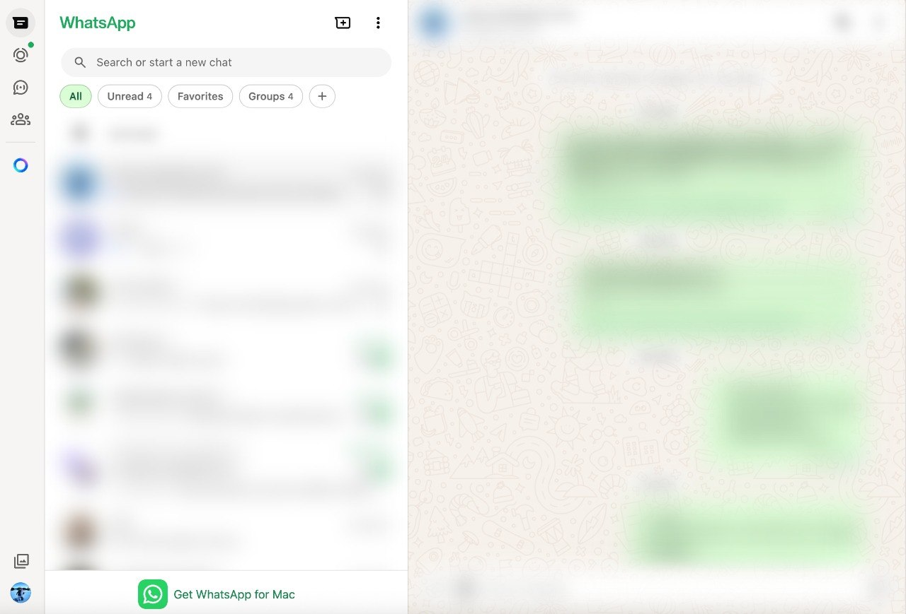

# WhatsApp Web Privacy Blur

A Chrome extension for privacy-friendly WhatsApp Web screen sharing and public use.

## Preview

## Features
- blur chat list
- blur chat detail / conversation area
- blur contact/header names
- popup toggle for each area
- settings persist with Chrome storage

## Install
1. Open Chrome and go to `chrome://extensions`
2. Enable **Developer mode**
3. Click **Load unpacked**
4. Select this folder:
   - `whatsapp-web-privacy-extension`

## Use
- Click the extension icon in Chrome
- Toggle any of:
  - **Blur chat list**
  - **Blur chat detail**
  - **Blur contact names**
- Changes apply instantly on WhatsApp Web

## Current behavior
Blurred areas become readable on hover/focus.

## Notes
WhatsApp Web changes its DOM often, so selectors may need future adjustment.
If you want, the next version can add:
- a global enable/disable switch
- stronger blur without hover reveal
- keyboard shortcut support
